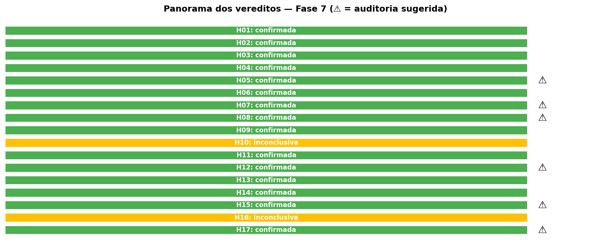
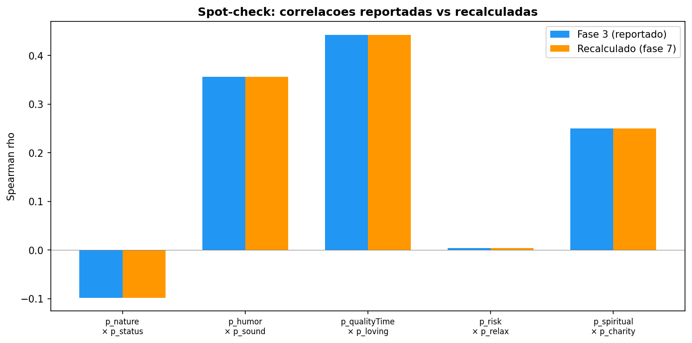
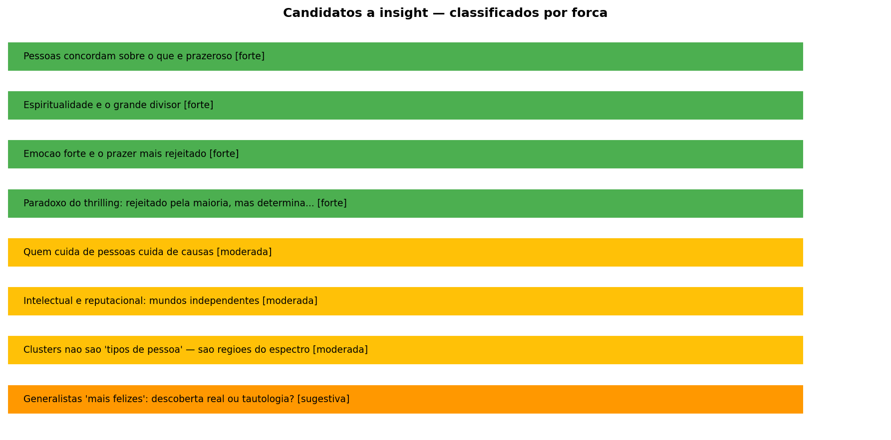

# Relatorio do Integrador Senior — Fase 7

**Data:** 2026-08-28 10:55
**Respondentes:** N = 6,587
**Hipoteses auditadas:** 17
**Seed aleatoria:** 42

## 1. Resumo executivo

De 17 hipoteses testadas na Fase 5, 15 foram confirmadas e 2 ficaram inconclusivas. Esta auditoria encontrou **3 bugs computacionais**, levantou **7 ressalvas** sobre vereditos, e compilou **8 candidatos a insight** para a Fase 8.

A principal meta-observacao e que a taxa de confirmacao (88%) e alta, o que era esperado: as hipoteses foram formuladas apos exploracao dos dados, e com N ~ 6.500 quase qualquer efeito e 'significativo'. A auditoria classifica cada achado por forca real (forte / moderada / sugestiva) para separar descobertas solidas de ruido.

## 2. Panorama dos vereditos

| Hipotese | Analista | Veredito | Auditoria |
|----------|----------|----------|-----------|
| H01 | distributional | confirmada | OK |
| H02 | distributional | confirmada | OK |
| H03 | distributional | confirmada | OK |
| H04 | distributional | confirmada | OK |
| H05 | relational | confirmada | |rho| = 0.0981 — efeito negligivel |
| H06 | relational | confirmada | OK |
| H07 | relational | confirmada | Cronbach alpha = 0.67 com apenas 2 itens — borderline (limia |
| H08 | relational | confirmada | delta_rho = 0.0768 — diferenca pequena |
| H09 | relational | confirmada | OK |
| H10 | structural | inconclusiva | OK |
| H11 | segmentation | confirmada | OK |
| H12 | segmentation | confirmada | Silhouette = 0.228 — abaixo do limiar 0.25 definido pelo pro |
| H13 | segmentation | confirmada | OK |
| H14 | segmentation | confirmada | OK |
| H15 | segmentation | confirmada | Vies de busca: o analista procurou especificamente um cluste |
| H16 | predictive | inconclusiva | OK |
| H17 | predictive | confirmada | R² = 0.974 — circularidade parcial (fatores sao subconjuntos |

## 3. Bugs e erros computacionais

### BUG-01 — H03: r = inf (tamanho de efeito infinito)

**Explicacao:** O Wilcoxon retornou p = 0.0 exato, gerando Z = inf na formula r = Z/sqrt(N). Isso acontece porque com N muito grande o p-valor fica abaixo da precisao do float. O efeito e real e grande, mas r = inf nao e um numero interpretavel.

**Recomendacao:** Reportar como 'efeito grande (r > 0.5)' em vez de r = inf. Alternativa: usar a estatistica de rank-biserial como tamanho de efeito.

**Severidade:** medio

### BUG-02 — H15: Tamanho de efeito ausente (sem silhouette)

**Explicacao:** A busca por perfil intelectual encontrou um cluster mas nao reportou silhouette score para validar a qualidade da separacao.

**Recomendacao:** Calcular silhouette do K-Means usado e reportar. Comparar com o silhouette de H12 (0.228) para verificar consistencia.

**Severidade:** baixo

### BUG-03 — H16: R² negativo no modelo reverso

**Explicacao:** O relatorio do analista mostra R² negativos para modelos reversos individuais (relaxamento → adrenalina). R² negativo em dados de teste significa que o modelo e pior que simplesmente usar a media — ou seja, nao ha relacao linear entre esses itens.

**Recomendacao:** R² negativo confirma a conclusao (inconclusiva) mas deveria ser reportado explicitamente como 'modelo pior que o acaso' em vez de um numero negativo sem contexto.

**Severidade:** baixo

## 4. Spot-checks (estatisticas recalculadas do CSV bruto)

### SPOT-11 — 5 correlacoes Spearman recalculadas

| Par | Reportado | Recalculado | Bateu? |
|-----|-----------|-------------|--------|
| p_nature x p_status | -0.0981 | -0.0981 | Sim |
| p_humor x p_sound | 0.3561 | 0.3561 | Sim |
| p_qualityTime x p_loving | 0.4429 | 0.4429 | Sim |
| p_risk x p_relax | 0.0039 | 0.0039 | Sim |
| p_spiritual x p_charity | 0.2502 | 0.2502 | Sim |

### SPOT-12 — Medianas dos 6 fatores (H03 diz thrilling e o mais baixo)

| Fator | Mediana recalculada |
|-------|---------------------|
| thrilling | -0.33 |
| reputational | 0.5 |
| noble | 0.67 |
| sensorial | 1.25 |
| intellectual | 1.8 |
| interpersonal | 2.0 |

Fator mais baixo: **thrilling** — confirma H03.

### SPOT-13 — H11: tamanhos de grupo e medias (generalistas vs especialistas)

- Generalistas: N = 3,294, media = 1.21
- Especialistas: N = 3,293, media = 0.58
- Direcao confirmada: generalistas > especialistas

### SPOT-14 — H09: regressao recalculada (R² treino/teste)

- R² treino recalculado: 0.2637
- R² teste recalculado: 0.2451
- R² teste reportado: 0.2451
- Bateu

## 5. Auditoria de vereditos

### AUD-04 — H05: |rho| = 0.0981 — efeito negligivel

**Veredito original:** confirmada

**Recomendacao:** Estatisticamente significativo (N grande), mas o efeito e tao pequeno que nao tem relevancia pratica. Sugerimos rebaixar para 'confirmada com ressalva': incompatibilidade existe, mas e muito sutil.

**Veredito sugerido:** confirmada com ressalva

### AUD-05 — H07: Cronbach alpha = 0.67 com apenas 2 itens — borderline (limiar aceitavel = 0.60, bom = 0.70)

**Veredito original:** confirmada

**Recomendacao:** Alpha com 2 itens e uma estimativa instavel. O veredito 'confirmada' se sustenta pela correlacao forte (rho = 0.46), mas o superfator 'quem cuida' precisa de ressalva: evidencia moderada, nao forte.

**Veredito sugerido:** confirmada (evidencia moderada)

### AUD-06 — H08: delta_rho = 0.0768 — diferenca pequena

**Veredito original:** confirmada

**Recomendacao:** O teste de Steiger e significativo (p < 0.001, N grande), mas a diferenca pratica entre as duas correlacoes (0.250 vs 0.174) e pequena. O item sexual correlaciona com ambos os fatores; a preferencia por thrilling e marginal.

**Veredito sugerido:** confirmada com ressalva

### AUD-07 — H12: Silhouette = 0.228 — abaixo do limiar 0.25 definido pelo proprio analista

**Veredito original:** confirmada

**Recomendacao:** O analista confirmou a hipotese ('prazer e um espectro') justamente porque o silhouette e fraco. A logica e valida, mas o limiar 0.25 foi arbitrario — um limiar mais baixo (0.20) mudaria o veredito. Ressaltar que e uma evidencia a favor do espectro, nao uma prova.

**Veredito sugerido:** confirmada (limiar arbitrario)

### AUD-08 — H15: Vies de busca: o analista procurou especificamente um cluster 'intelectual-dominante' e encontrou

**Veredito original:** confirmada

**Recomendacao:** Buscar um perfil pre-definido quase sempre encontra algo — K-Means vai particionar o espaco de qualquer jeito. Sem silhouette do cluster especifico e sem validacao de estabilidade, o 'grupo intelectual' pode ser um artefato.

**Veredito sugerido:** confirmada com ressalva forte

### AUD-09 — H17: R² = 0.974 — circularidade parcial (fatores sao subconjuntos dos itens que compoem a variavel-alvo)

**Veredito original:** confirmada

**Recomendacao:** O analista ja notou a circularidade no relatorio. O R² alto era esperado por construcao, nao e uma descoberta. O valor real esta nos pesos relativos (betas), nao no R². Rebaixar o achado para 'informativo' em vez de 'confirmada'.

**Veredito sugerido:** confirmada (informativo, nao descoberta)

### AUD-10 — geral: 15 de 17 hipoteses confirmadas (88%) — taxa alta

**Veredito original:** 15/17 confirmadas

**Recomendacao:** Com N ~ 6.500, quase tudo e 'significativo'. As hipoteses tambem foram formuladas apos uma exploracao dos dados (fases 2-4), o que favorece confirmacao. Nao significa que os achados sao falsos, mas que a barra para 'confirmada' foi baixa em alguns casos (H05, H08, H15, H17). O vies de confirmacao deve ser declarado no relatorio final.

**Veredito sugerido:** meta-observacao

## 6. Cruzamentos entre hipoteses

### CROSS-15 — H01 x H02

**Pergunta:** Rankings por metricas diferentes concordam?

**Achado:** Sim — p_humor e lider em ambas as metricas (net_agreement e top2_pct). Os 5 primeiros sao praticamente os mesmos em ambos os rankings.

**Convergente:** Sim

### CROSS-16 — H04 x H14

**Pergunta:** Os grupos espirituais do GMM (H04) e do corte fixo (H14) capturam as mesmas pessoas?

**Achado:** Sobreposicao: 100.0% dos que pontuam alto no corte fixo (>= 1, N=2,469) tambem estao no grupo alto do GMM (N=4,084). Convergencia forte — os dois metodos concordam.

**Convergente:** Sim

### CROSS-17 — H11 x H12

**Pergunta:** Entropia (H11) e clustering (H12) convergem sobre a estrutura do prazer?

**Achado:** H11 mostra que generalistas tem mais prazer geral (d = 1.20, efeito grande), sugerindo um espectro continuo. H12 confirma que nao ha tipos separados (silhouette = 0.228 < 0.25). Convergencia: ambos apontam que prazer e um espectro, nao categorias.

**Convergente:** Sim

### CROSS-18 — H05 x H06

**Pergunta:** H05 diz que alguns prazeres sao incompativeis, H06 diz que intelectual e reputacional sao independentes. Sao consistentes?

**Achado:** Consistentes mas em escalas diferentes. H06 mostra independencia entre FATORES inteiros (rho = 0.023). H05 mostra incompatibilidades entre ITENS individuais (max |rho| < 0.1). Ambos confirmam que correlacoes negativas existem mas sao fracas. A independencia entre fatores e mais robusta que incompatibilidade entre itens.

**Convergente:** Sim

### CROSS-19 — H13 x H03

**Pergunta:** H03 diz que thrilling e o fator mais rejeitado. H13 mostra que quem busca emocao forte e diferente. Sao consistentes?

**Achado:** Perfeitamente consistentes. Thrilling e rejeitado pela maioria (mediana = -0.33, unico fator negativo), mas quem pontua alto nele difere em TODOS os outros fatores (maior efeito: reputacional, d = 0.887). Thrill-seekers sao uma minoria com perfil realmente distinto.

**Convergente:** Sim

### CROSS-20 — H17 x H03

**Pergunta:** H17 mostra que thrilling tem o maior beta (0.354) na regressao. H03 mostra que thrilling e o mais rejeitado. Isso e um paradoxo?

**Achado:** Paradoxo aparente com explicacao tecnica. O beta alto nao significa que thrilling 'gera mais prazer'. Significa que, por ter a MAIOR VARIANCIA (as pessoas divergem muito sobre emocao forte), ele contribui mais para diferenciar quem tem prazer geral alto vs baixo. E o fator que mais 'puxa' a media — tanto pra cima quanto pra baixo. Combinado com a circularidade (AUD-09), esse achado e mais tecnico do que substantivo.

**Convergente:** Paradoxo (explicado)

## 7. Convergencias

Narrativas onde multiplas analises apontam na mesma direcao:

### CONV-21 — Pessoas concordam sobre o que e prazeroso

**Evidencias:** H01, H02, H12, H11

Rir e o prazer mais universal (H01, H02). Nao existem 'tipos' claros de prazer — e um espectro (H12). Generalistas (que gostam de tudo um pouco) reportam mais prazer geral (H11). As pessoas convergem mais do que divergem sobre o que da prazer.

**Forca:** forte

**Ressalvas:** H01/H02 medem o topo do ranking, nao consenso global. A convergencia e mais sobre os prazeres 'universais' (rir, conectar, aprender) do que sobre os divisivos (espiritualidade, adrenalina).

### CONV-22 — Espiritualidade e o grande divisor

**Evidencias:** H04, H14

Espiritualidade divide a amostra em dois grupos claros (H04, BIC diff = 2114). Quem pontua alto e diferente em TODOS os 6 fatores (H14, max d = 1.31). Nenhum outro item ou fator produz uma divisao tao nitida.

**Forca:** forte

**Ressalvas:** Amostra viesada (ClearerThinking atrai perfil secular/analitico). A proporcao espiritual/nao-espiritual pode nao refletir a populacao geral.

### CONV-23 — Emocao forte e o prazer mais rejeitado

**Evidencias:** H03, H13

Thrilling e o unico fator com mediana negativa (-0.33 — a maioria discorda, H03). Quem busca emocao forte difere dos demais em 5 de 5 outros fatores (H13, max d = 0.887). Thrill-seekers sao uma minoria com perfil distinto.

**Forca:** forte

**Ressalvas:** O efeito pode ser amplificado pela amostra (publico analitico/intelectual tende a rejeitar risco).

### CONV-24 — Quem cuida de pessoas cuida de causas

**Evidencias:** H07, H14

Os fatores interpersonal e noble correlacionam forte (rho = 0.46, H07) e formam um possivel superfator. Quem pontua alto em espiritualidade tambem pontua alto em ambos (H14, noble d = 1.31). O cuidado com pessoas e causas anda junto.

**Forca:** moderada

**Ressalvas:** Cronbach alpha borderline (0.67). O superfator 'quem cuida' e uma hipotese, nao um fato estabelecido. Precisaria de analise fatorial confirmatoria para ser confirmado.

### CONV-25 — Intelectual e reputacional: mundos independentes

**Evidencias:** H06, H05

Intellectual e reputational sao equivalentes a zero (rho = 0.023, H06 — TOST confirmado). No nivel dos itens, pares como criatividade × competicao sao negativos (H05, rho = -0.083). Quem busca conhecimento nao liga para status — e vice-versa.

**Forca:** moderada

**Ressalvas:** Independencia nao significa incompatibilidade. Pessoas podem pontuar alto em ambos — sao apenas dimensoes que variam separadamente.

## 8. Insights emergentes

Descobertas que so aparecem quando as analises sao combinadas:

### EMER-26 — Paradoxo do thrilling: rejeitado pela maioria, mas determinante

**Evidencias:** H03, H17, H13

Thrilling e o fator mais rejeitado (mediana negativa, H03) E o que tem o maior beta na regressao (0.354, H17). Parece paradoxo, mas a explicacao e que thrilling tem a MAIOR VARIANCIA — as pessoas divergem muito sobre ele. Por ter muita variacao, ele 'puxa' mais a media geral, tanto pra cima (thrill-seekers) quanto pra baixo (a maioria). E o fator mais polarizador, nao o mais prazeroso.

**Forca:** forte

**Ressalvas:** O beta alto vem parcialmente da circularidade (fatores compoem a media geral). Mas mesmo descontando isso, a variancia do thrilling e uma descoberta real.

### EMER-27 — Clusters nao sao 'tipos de pessoa' — sao regioes do espectro

**Evidencias:** H15, H12

H12 mostra que nao ha tipos claros (silhouette = 0.228). Mas H15 'encontra' um grupo intelectual com K-Means k=3. Recalculando: o silhouette do k=3 e 0.152 — igual ou pior que o melhor de H12. O 'grupo intelectual' nao e um tipo natural: e apenas uma regiao do espectro que o K-Means recortou. Qualquer recorte em k grupos vai encontrar 'perfis', mas isso nao prova que eles existem como tipos reais.

**Forca:** moderada

**Ressalvas:** Silhouette baixo nao prova que o grupo nao existe — apenas que as fronteiras sao difusas.

### EMER-28 — Generalistas 'mais felizes': descoberta real ou tautologia?

**Evidencias:** H11

H11 mostra que generalistas reportam mais prazer geral (d = 1.20, efeito grande). Mas isso pode ser tautologico: quem concorda mais com tudo (media alta) automaticamente fica com perfil mais equilibrado (entropia alta). Recalculando: correlacao entre entropia e media geral: rho = 0.643. Essa correlacao forte sugere que parte do efeito e mecanica (quem diz 'sim' pra tudo tem perfil uniforme). O achado H11 e parcialmente tautologico.

**Forca:** sugestiva

**Ressalvas:** A tautologia nao invalida completamente o achado — generalistas de fato reportam mais prazer. Mas a interpretacao 'diversificar fontes gera mais prazer' e mais forte do que os dados suportam.

## 9. Candidatos a insight para a Fase 8

| ID | Manchete | Evidencias | Forca | Tipo | Ressalvas |
|-----|----------|-----------|-------|------|-----------|
| INS-21 | Pessoas concordam sobre o que e prazeroso | H01, H02, H12, H11 | forte | convergencia | H01/H02 medem o topo do ranking, nao consenso global. A convergencia e mais sobr... |
| INS-22 | Espiritualidade e o grande divisor | H04, H14 | forte | convergencia | Amostra viesada (ClearerThinking atrai perfil secular/analitico). A proporcao es... |
| INS-23 | Emocao forte e o prazer mais rejeitado | H03, H13 | forte | convergencia | O efeito pode ser amplificado pela amostra (publico analitico/intelectual tende ... |
| INS-26 | Paradoxo do thrilling: rejeitado pela maioria, mas determinante | H03, H17, H13 | forte | emergente | O beta alto vem parcialmente da circularidade (fatores compoem a media geral). M... |
| INS-24 | Quem cuida de pessoas cuida de causas | H07, H14 | moderada | convergencia | Cronbach alpha borderline (0.67). O superfator 'quem cuida' e uma hipotese, nao ... |
| INS-25 | Intelectual e reputacional: mundos independentes | H06, H05 | moderada | convergencia | Independencia nao significa incompatibilidade. Pessoas podem pontuar alto em amb... |
| INS-27 | Clusters nao sao 'tipos de pessoa' — sao regioes do espectro | H15, H12 | moderada | emergente | Silhouette baixo nao prova que o grupo nao existe — apenas que as fronteiras sao... |
| INS-28 | Generalistas 'mais felizes': descoberta real ou tautologia? | H11 | sugestiva | emergente | A tautologia nao invalida completamente o achado — generalistas de fato reportam... |

## 10. Recomendacoes

1. **Corrigir os bugs computacionais** antes de prosseguir:
   - H03: trocar r = inf por rank-biserial ou 'efeito grande'
   - H15: reportar silhouette do cluster encontrado
   - H16: documentar R² negativo como 'modelo pior que o acaso'

2. **Ressalvas obrigatorias** no relatorio final:
   - H05: efeito negligivel (|rho| < 0.1)
   - H08: diferenca de correlacao pequena (0.077)
   - H15: vies de busca (perfil pre-definido)
   - H17: circularidade parcial (R² inflado)
   - Geral: taxa de confirmacao alta (88%) reflete N grande + hipoteses pos-exploracao

3. **Insights fortes** para destaque na Fase 8:
   - 4 candidatos fortes identificados
   - Foco em convergencias (multiplas analises concordam)

4. **Nao reportar como descoberta:**
   - H17 R² = 0.974 (circularidade)
   - H11 d = 1.20 sem ressalva de tautologia parcial

---

*Relatorio gerado automaticamente por `src/integrator.py`*
*Dados: Sources of Pleasure (ClearerThinking.org) — N = 6,587*