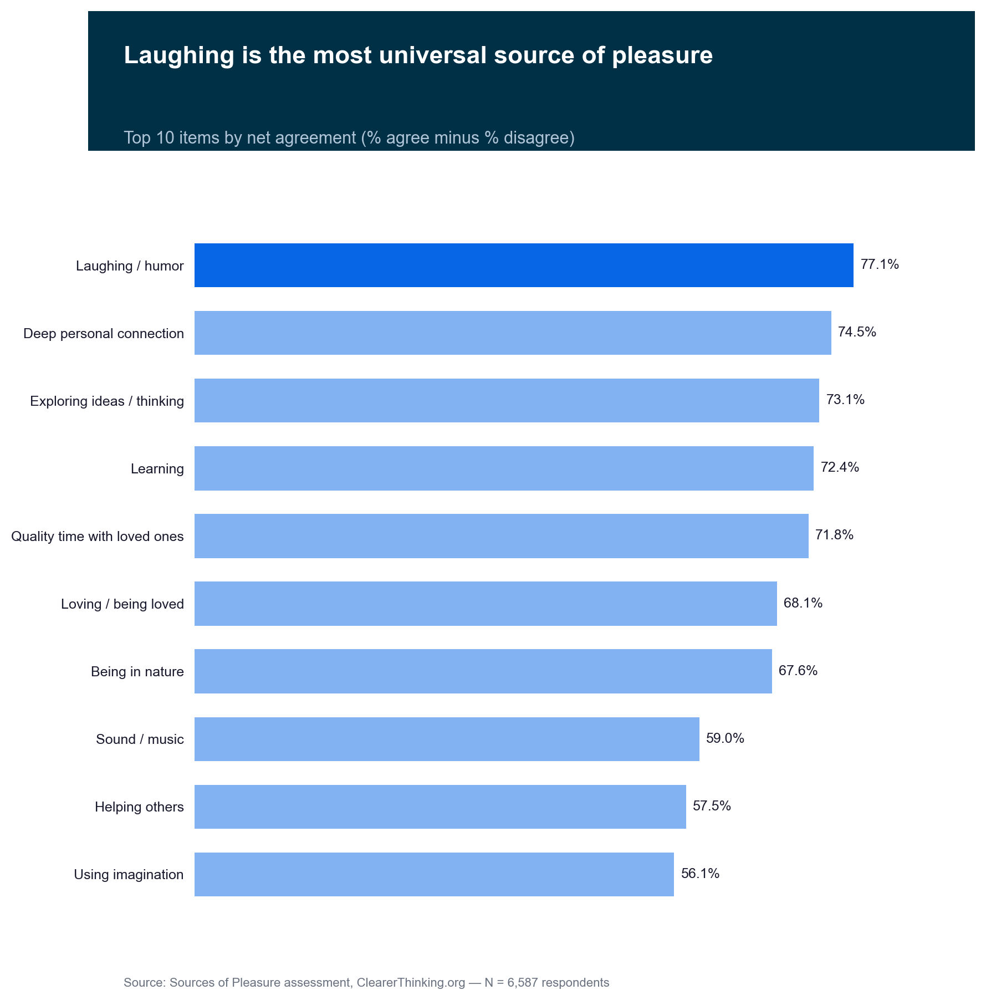
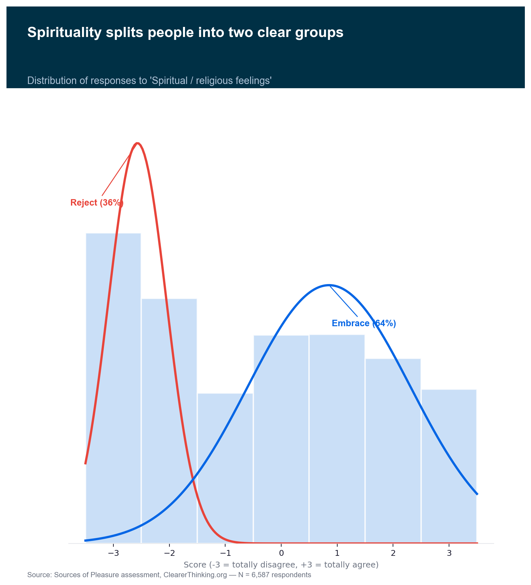
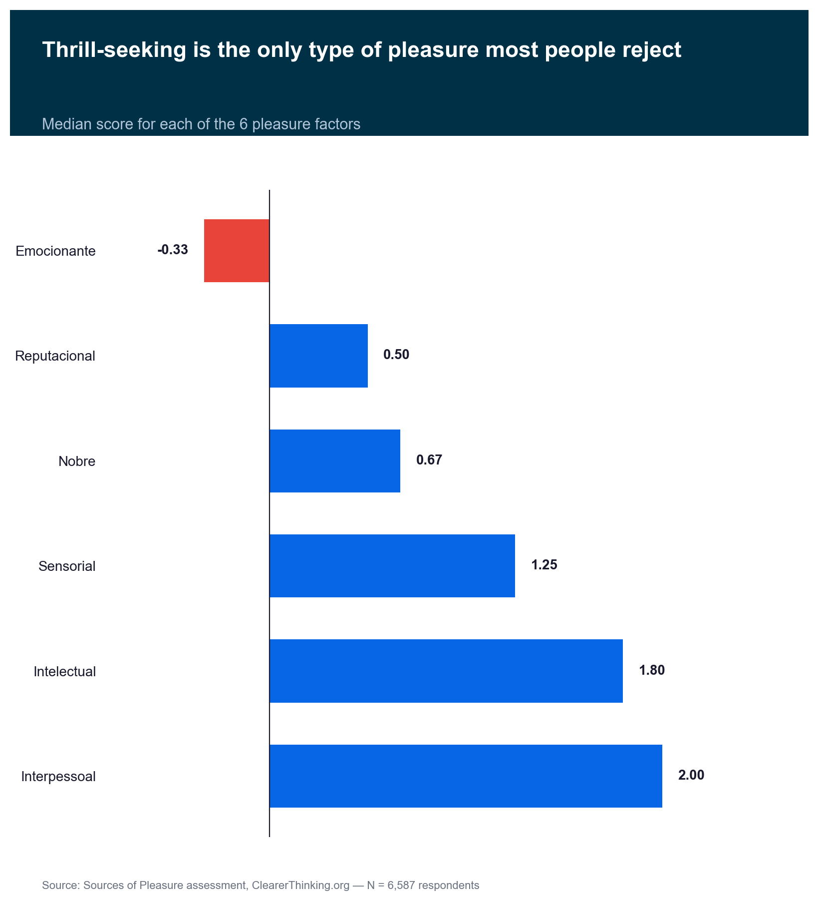
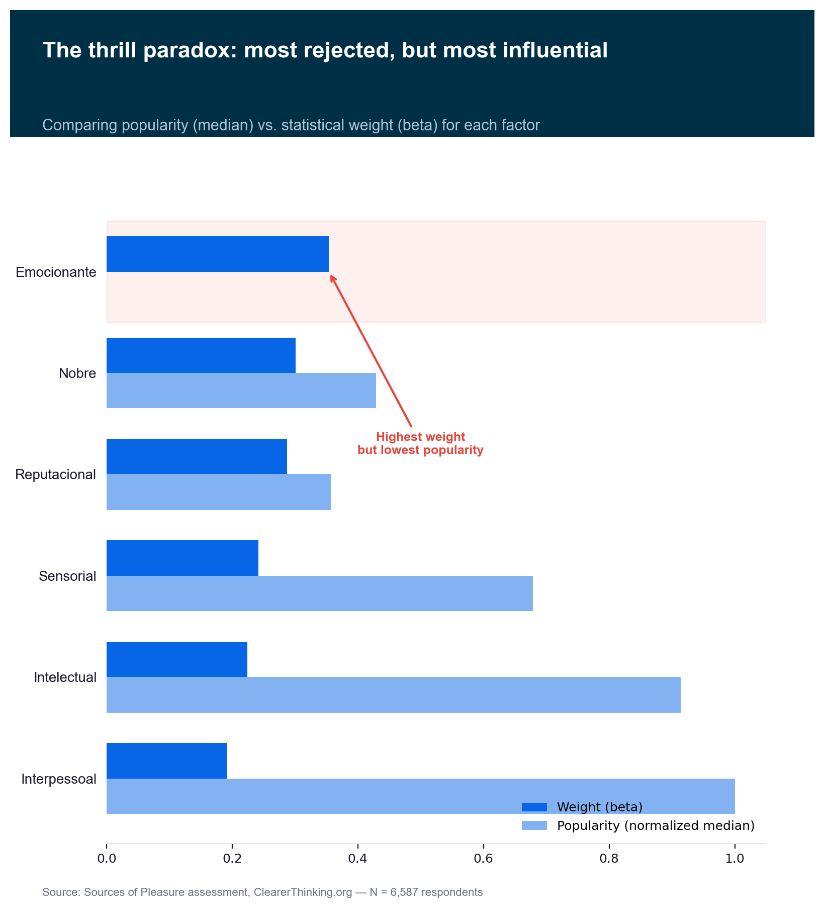
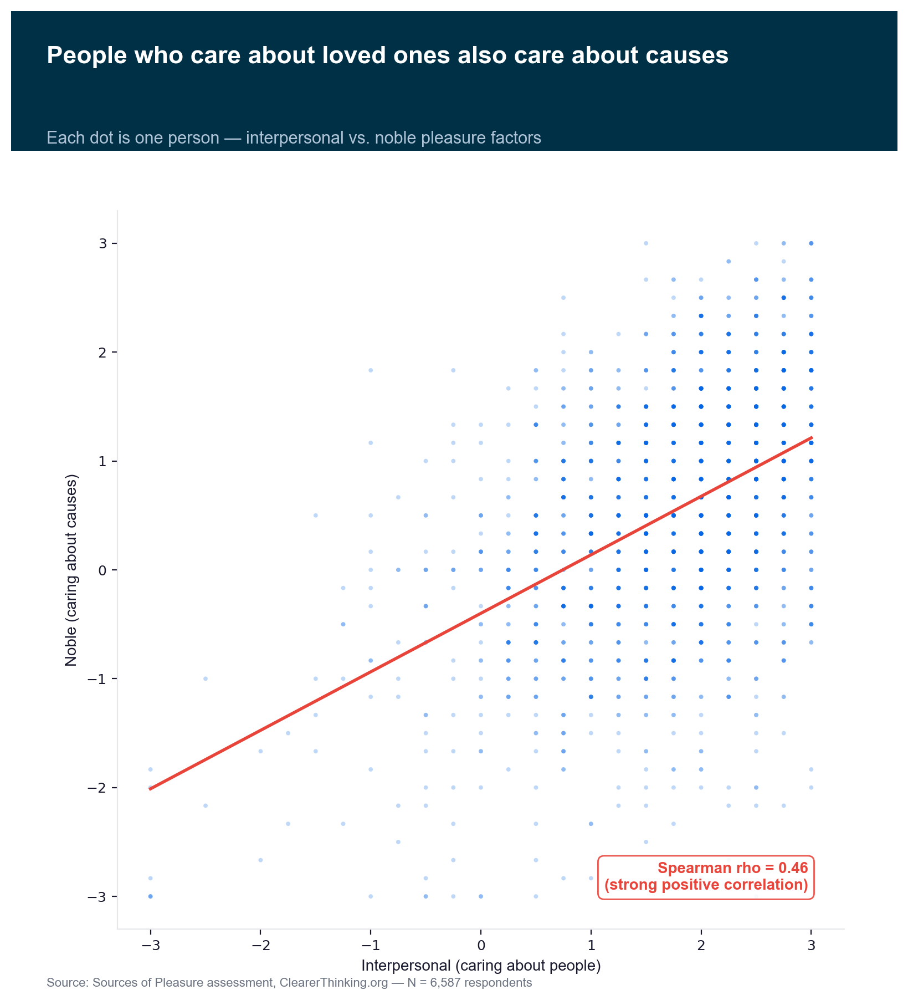
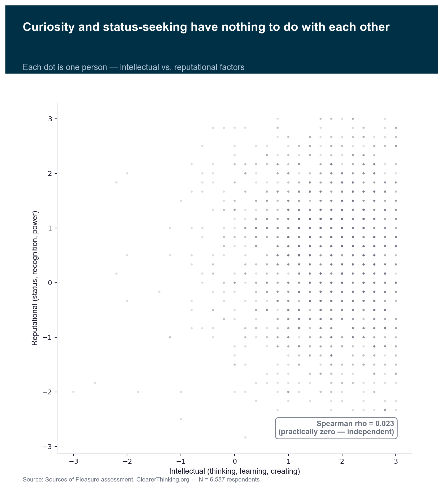
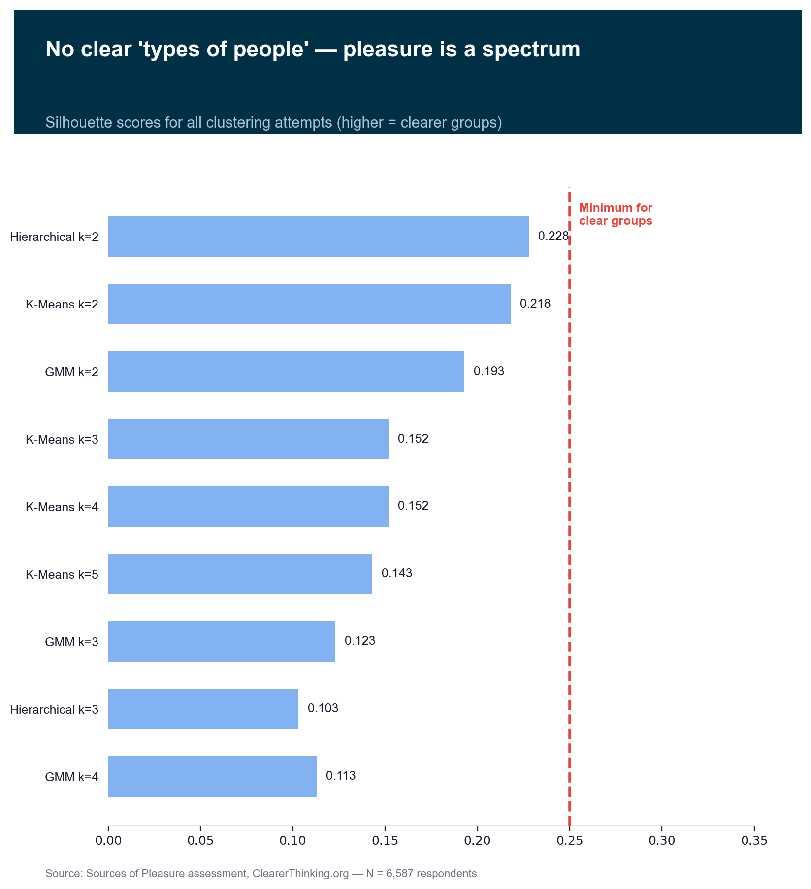
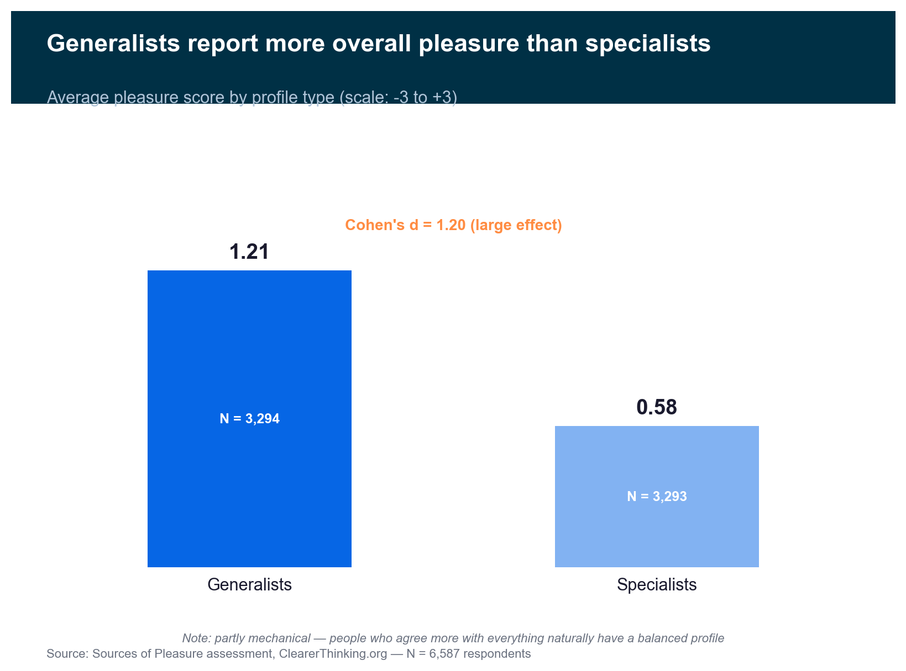

# De onde vem o prazer? — 8 descobertas sobre o que faz as pessoas felizes

**Data:** 2026-08-28
**Dados:** Sources of Pleasure (ClearerThinking.org) — N = 6,587 respondentes

---

> Este documento apresenta 8 descobertas sobre as fontes de prazer humano,
> baseadas em respostas de quase 7.000 pessoas a 37 perguntas sobre o que
> lhes da prazer. Cada grafico conta uma parte da historia — comecamos pelo
> que todo mundo concorda e terminamos com os paradoxos que so aparecem
> quando olhamos os dados de varios angulos ao mesmo tempo.

---

## 1. Rir e o prazer mais universal

### O que este grafico mostra

Das 37 fontes de prazer avaliadas, **rir e ter humor** e a que mais pessoas
concordam que lhes da prazer. 77% dos respondentes marcaram "concordo" ou
"concordo totalmente" nesse item — mais do que qualquer outro.

O top 5 e revelador: rir, conexao pessoal profunda, explorar ideias,
aprender e tempo de qualidade com quem se ama. Sao prazeres simples,
acessiveis e universais — nao luxos ou aventuras.

### Como chegamos a essa conclusao

Calculamos a "concordancia liquida" de cada item (% que concorda menos %
que discorda) e usamos bootstrap (1.000 reamostras) para construir
intervalos de confianca. O intervalo do humor nao se sobrepoem com o
segundo colocado — a lideranca e estatisticamente real.

### O que isso significa

Se voce quer mais prazer na vida, as respostas mais populares nao envolvem
dinheiro, aventura ou status. Envolvem rir, conectar-se com pessoas e
alimentar a curiosidade. Essas sao as fontes de prazer em que a
humanidade mais concorda.

### Ressalvas

A amostra vem do ClearerThinking.org — provavelmente pessoas mais
analiticas e curiosas que a media. Em outra populacao, o ranking poderia
mudar. E a diferenca entre os 5 primeiros e pequena (2-5 pontos
percentuais).

---

## 2. Espiritualidade racha a sala ao meio

### O que este grafico mostra

Enquanto a maioria dos itens tem uma distribuicao "normal" (a maioria das
pessoas no meio, poucos nos extremos), **espiritualidade** e completamente
diferente. O grafico mostra dois grupos claros: cerca de 36% das pessoas
rejeitam fortemente (concentradas nas notas -3 e -2) e 64% se posicionam
do neutro ao positivo.

Nao existe meio-termo suave — a distribuicao tem dois picos separados,
nao uma curva unica.

### Como chegamos a essa conclusao

Ajustamos um modelo estatístico (mistura gaussiana) que tenta encaixar 1
ou 2 "curvas de sino" nos dados. Com 2 curvas o ajuste e dramaticamente
melhor (BIC diff = 2.114 — qualquer valor acima de 10 ja e forte).
Alem disso, quem pontua alto em espiritualidade difere em TODOS os 6
tipos de prazer (o maior efeito: d = 1.31 no fator "nobre").

### O que isso significa

Espiritualidade e o grande divisor. E o unico item que cria dois grupos
realmente distintos. Quem valoriza espiritualidade tende a valorizar mais
TUDO — cuidar dos outros, sensacoes, ideias. E um perfil de prazer
completamente diferente.

### Ressalvas

A amostra do ClearerThinking provavelmente tem menos pessoas religiosas
que a populacao geral. A proporcao 36/64 pode nao se aplicar a todo mundo.

---

## 3. Emocao forte e o unico prazer que a maioria rejeita

### O que este grafico mostra

Dos 6 grandes tipos de prazer, **"emocionante" (thrilling) e o unico com
mediana negativa**. Isso significa que mais da metade das pessoas
discordam que adrenalina, risco e sustos lhes dao prazer.

Todos os outros fatores — interpessoal, intelectual, sensorial, nobre e
ate reputacional — tem mediana positiva.

### Como chegamos a essa conclusao

Calculamos a mediana de cada fator (a media dos itens que compoem cada
grupo) e comparamos com um teste estatistico (Wilcoxon). A diferenca
entre thrilling e o segundo mais baixo (reputacional) e grande e
estatisticamente real.

### O que isso significa

Buscar adrenalina, correr riscos e se assustar por diversao nao sao
fontes de prazer para a maioria. Enquanto a maioria concorda que rir,
pensar e amar dao prazer, a emocao forte e polarizadora — uns amam,
a maioria rejeita.

### Ressalvas

A amostra pode exagerar esse efeito — o publico do ClearerThinking
provavelmente e mais intelectual e menos aventureiro que a populacao
geral.

---

## 4. O paradoxo: o prazer mais rejeitado e o que mais diferencia as pessoas

### O que este grafico mostra

Este grafico compara duas coisas para cada tipo de prazer: **quanto as
pessoas gostam** (popularidade) e **quanto ele pesa na formula do prazer
geral** (peso estatistico/beta).

O resultado surpreendente: **thrilling e o menos popular MAS tem o maior
peso**. E o fator que mais "puxa" o prazer geral — tanto pra cima quanto
pra baixo.

### Como chegamos a essa conclusao

Este insight so aparece quando combinamos tres analises diferentes:
a rejeicao do thrilling (H03), o beta da regressao (H17) e o perfil
dos thrill-seekers (H13). Nenhuma analise sozinha revela o paradoxo.

### O que isso significa

Thrilling nao e o "motor" do prazer — e o **termometro que mais varia**.
Como as pessoas divergem muito sobre emocao forte (uns amam, a maioria
odeia), esse fator e o que mais diferencia quem tem prazer geral alto
de quem tem baixo. Quem busca adrenalina tende a gostar de tudo mais
tambem; quem rejeita tende a ser mais seletivo.

### Ressalvas

O peso (beta) vem de uma regressao com circularidade parcial — os
fatores fazem parte da formula do prazer geral. Os pesos relativos sao
informativos, mas o R² alto (0.974) nao e uma descoberta independente.

---

## 5. Quem cuida de pessoas tambem cuida de causas

### O que este grafico mostra

Cada ponto e uma pessoa. O eixo horizontal mede quanto ela valoriza
prazeres interpessoais (tempo de qualidade, pertencer, amar) e o eixo
vertical mede quanto valoriza prazeres "nobres" (caridade, comunidade,
ajudar). A linha vermelha mostra a tendencia.

**Quem pontua alto em um, pontua alto no outro.** A correlacao e forte
(rho = 0.46).

### Como chegamos a essa conclusao

Calculamos a correlacao de Spearman entre os dois fatores e testamos se
eles funcionam como uma dimensao unica (alpha de Cronbach = 0.67 —
aceitavel). O grupo espiritual pontua alto em ambos, reforcando a
conexao.

### O que isso significa

Parece existir uma dimensao latente de "cuidado" — pessoas que se
importam com seus entes queridos tambem tendem a se importar com
causas maiores. Nao sao coisas separadas: quem cuida, cuida de tudo.

### Ressalvas

A correlacao 0.46 e forte mas nao fortissima — os dois fatores ainda
tem variancia propria. O "superfator cuidador" e uma hipotese, nao um
fato confirmado.

---

## 6. Gostar de pensar nao tem nada a ver com querer status

### O que este grafico mostra

Compare este grafico com o anterior. Enquanto interpessoal e nobre
mostram um padrao claro (pra cima e pra direita), **intelectual e
reputacional formam uma nuvem sem direcao nenhuma**. A correlacao e
praticamente zero (rho = 0.023).

### Como chegamos a essa conclusao

Usamos um teste de equivalencia (TOST) que nao apenas mostra que a
correlacao nao e significativa — mostra que ela e **significativamente
igual a zero**. Isso e mais forte que "nao encontramos relacao": e
"provamos que nao ha relacao".

### O que isso significa

Gostar de pensar, criar e aprender nao faz voce buscar nem evitar
status, reconhecimento ou poder. As duas coisas simplesmente nao tem
relacao. Isso desafia a intuicao de que "intelectuais desprezam status"
— na verdade, as duas dimensoes variam de forma completamente
independente.

### Ressalvas

Independencia nao e incompatibilidade. Existem pessoas que pontuam alto
em ambos — elas apenas nao sao mais comuns do que o acaso prediria.

---

## 7. Nao existem "tipos de pessoa" no prazer

### O que este grafico mostra

Tentamos agrupar as pessoas em "tipos" usando tres metodos diferentes
de agrupamento (K-Means, hierarquico e mistura gaussiana) com 2 a 8
grupos. O grafico mostra a qualidade de cada tentativa (silhouette —
quanto maior, mais claros os grupos).

**Nenhuma tentativa superou o limiar minimo** (linha vermelha tracejada
em 0.25). Os grupos sao sempre difusos e mal definidos.

### Como chegamos a essa conclusao

Rodamos 21 combinacoes de metodo × numero de grupos e verificamos a
estabilidade com 100 sub-amostras. O melhor resultado (0.228) ainda e
fraco. Um analista tambem tentou buscar especificamente um "grupo
intelectual" — encontrou, mas com silhouette ainda pior (0.152).

### O que isso significa

E tentador pensar que existem "o intelectual", "o aventureiro", "o
cuidador" como tipos fixos de pessoa. Mas os dados nao sustentam isso.
O prazer e um espectro continuo — as pessoas se distribuem gradualmente,
sem fronteiras naturais. Quando um algoritmo "encontra" grupos, as
bordas sao tao difusas que nao faz sentido chamar de tipos.

### Ressalvas

Silhouette baixo nao prova que tipos nao existem — apenas que esses
metodos nao os encontram nestes dados. Com variaveis demograficas
(idade, genero, pais), talvez surgissem padroes mais claros.

---

## 8. Quem gosta de tudo um pouco reporta mais prazer — mas cuidado com essa conclusao

### O que este grafico mostra

Dividimos as pessoas em dois grupos: **generalistas** (perfil
equilibrado, gostam de varios tipos de prazer) e **especialistas**
(perfil concentrado, focam em poucos tipos). Os generalistas reportam
significativamente mais prazer geral (media 1.21 vs 0.58).

A diferenca e grande (d = 1.20 — um dos maiores efeitos encontrados
nesta analise).

### Como chegamos a essa conclusao

Usamos a entropia de Shannon (uma medida de o quanto o perfil de prazer
e equilibrado vs concentrado) para dividir as pessoas pela mediana.
Depois comparamos o prazer medio geral entre os dois grupos.

### O que isso significa

A primeira leitura seria: "diversifique suas fontes de prazer e voce
sera mais feliz". Mas essa interpretacao e mais forte do que os dados
permitem.

**O problema:** quem diz "concordo" pra tudo (media alta) automaticamente
fica com perfil equilibrado (entropia alta). A correlacao entre entropia
e media geral e 0.64 — forte e parcialmente mecanica. Parte do efeito
e real, mas parte e um artefato matematico.

### Ressalvas

Nao podemos afirmar que diversificar fontes de prazer CAUSA mais
satisfacao. Pode ser que pessoas naturalmente mais satisfeitas
simplesmente concordem mais com tudo. Sao dados de um unico momento,
sem acompanhamento ao longo do tempo.

---

## Nota final

Estas descobertas vem de um questionario online respondido por quase
7.000 pessoas no site ClearerThinking.org. A amostra provavelmente
e mais analitica, curiosa e secular que a populacao geral — o que pode
influenciar os rankings e proporcoes.

Todos os numeros sao associacoes, nao causas. "Quem busca adrenalina
tambem valoriza status" nao significa que uma coisa causa a outra.

Os insights fortes (I01-I04) sao sustentados por multiplas analises
convergentes. Os moderados (I05-I07) tem evidencia solida mas com
ressalvas. O sugestivo (I08) tem um efeito grande mas parcialmente
tautologico.

---

*Narrativa gerada por `scripts/phase9_storytelling.py`*
*Pipeline: Fases 0-9 | Dados: Sources of Pleasure (ClearerThinking.org) — N = 6,587*